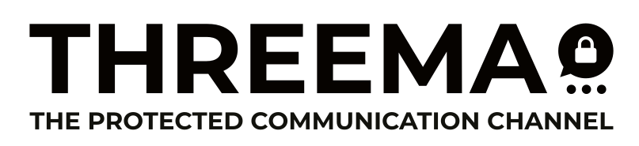

  <!-- Centered README header hack -->
  <!-- Note: Do not replace the obsolete align attribute with inline style, as GitHub may strip it. -->
  <picture>
    <source media="(prefers-color-scheme: dark)" srcset="logo_dark.svg">
    <source media="(prefers-color-scheme: light)" srcset="logo_light.svg">
    
  </picture>
    

---

# Threema for Desktop

A standalone Threema client for the desktop (Windows/macOS/Linux).

## Table of Contents

- [Policies](#policies)
  - [Bug Reports / Feature Requests / Security Issues](#issues)
  - [Contributions](#contributions)
  - [Source Code Release Policy](#release-policy)
- [Building](#building)
  - [Requirements](#requirements)
  - [Install Dependencies](#install-dependencies)
  - [Set Up Fonts](#set-up-fonts)
  - [Build libthreema](#build-libthreema)
  - [Build binaries](#build-binaries)
  - [Build and Package](#build-and-package)
- [Development](#development)
  - [Dev Container](#dev-container)
  - [Development Outside Dev Container](#no-dev-container)
  - [Starting a Dev Build](#dev-build)
- [License](#license)

## Policies

### Bug Reports / Feature Requests / Security Issues

To report bugs and request new features, please contact the Threema support team through
[threema.ch/support](https://threema.ch/support).

If you discover a security issue in Threema, please adhere to the coordinated vulnerability
disclosure model. To be eligible for a bug bounty, please
[file a report on GObugfree](https://app.gobugfree.com/programs/threema) (where all the details,
including the bounty levels, are listed). If you’re not interested in the bug bounty program, you
can contact us via Threema or by email; for contact details, see
[threema.ch/contact](https://threema.ch/contact) (section “Security”).

### Contributions

Contributing to Threema for desktop can be done over GitHub pull requests. See
[CONTRIBUTING.md](CONTRIBUTING.md) for details.

### Source Code Release Policy

This source code repository will be updated for every public release. The full commit history since
the last release will be published.

## Building

### Requirements

- Node.js / pnpm (we recommend using something like nvm and corepack for version management)
- Python3 with distutils (for [`node-gyp`], e.g. `python` and `python-setuptools` on Arch)
- C/C++ compiler toolchain (e.g. `build-essential` on Debian or `base-devel` on Arch)
- Rust compiler and Cargo through `rustup`
- For building libthreema: `wasm-bindgen` and `wasm-opt` (part of the `binaryen` package)

It is highly recommended to use a Linux- or macOS-based system for building and developing Threema
Desktop! Building on Windows 10+ should mostly work, but not everything may work as smoothly and we
cannot provide any support.

#### macOS

On macOS you might need to manually install and configure the C compiler toolchain in order to use
[`node-gyp`]. Usually that can be done by installing the required "Command Line Tools" with the
command `xcode-select --install`. Alternatively, you can install [Xcode] (note that it might take
more than 1h between download and installation!) and then select a "Command Line Tools" version in
Preferences > Locations. For a detailed guide and diagnostics, please refer to the ["Installation
notes for macOS"][node-gyp_macos_catalina] from the `node-gyp` project itself.

[`node-gyp`]: https://github.com/nodejs/node-gyp
[xcode]: https://apps.apple.com/us/app/xcode/id497799835?mt=12
[node-gyp_macos_catalina]:
  https://github.com/nodejs/node-gyp/blob/master/macOS_Catalina.md#installing-node-gyp-using-the-xcode-command-line-tools-via-xcode-select---install

#### Windows

When building on Windows, it is important to clone the repository with [symlink
support][win-symlinks]. For this, you first need to [enable Developer Mode][win-devmode]. Then, run
the following command to [enable git support for symlinks globally][win-git-symlinks]:

    git config --global core.symlinks true

Afterwards clone the repository as usual. (Alternatively, clone with
`git clone -c core.symlinks=true ...` if you don't want to enable this option globally.)

[win-symlinks]: https://blogs.windows.com/windowsdeveloper/2016/12/02/symlinks-windows-10/
[win-devmode]:
  https://learn.microsoft.com/en-us/windows/apps/get-started/enable-your-device-for-development
[win-git-symlinks]: https://github.com/git-for-windows/git/wiki/Symbolic-Links

### Install Dependencies

First, make sure that you're using the correct Node.js version (check out the `.nvmrc` file). If you
have [nvm] installed, you can simply type `nvm use`.

Next, install dependencies:

    pnpm install

Note that this requires a C/C++ compiler toolchain due to native dependencies, as mentioned above.

[nvm]: https://github.com/nvm-sh/nvm

### Build libthreema

When building the project or starting it in dev mode, the `libthreema-wasm` package will be built
automatically. If you want to build it separately, run `pnpm run build:packages:libthreema-wasm`.

Note: To build `libthreema`, [`wasm-bindgen`](https://github.com/rustwasm/wasm-bindgen) and
[`wasm-opt`](https://github.com/WebAssembly/binaryen) need to be installed on the system.

### Build binaries

To build the application for the current platform without packaging it, run:

    pnpm run dist:desktop:<flavor>

Now you can find the binaries at `build/apps/desktop/packaged/`.

### Build and Package

To build and package the application for the current platform, run:

    pnpm run package:desktop:<flavor>

For example, to build Threema for your current platform, run:

    pnpm run package:desktop:consumer-live

Now you can find the application bundle at `build/out/`.

Note: To build a signed package, set `TURBO_PACKAGE_SIGNATURE` to `true`, and make sure the
necessary tooling for signing binaries on the respective platform has been set up.

## Development

Below we'll provide a couple of hints and rules for working on this project.

More developer docs can be found under [docs/](./docs/).

### Dev Container

When developing, you should use the dev container environment to run appropriate commands inside of
an isolated environment considering that any Node.js dependency can run arbitrary code and we have a
ton of development dependencies.

This dev container can be used in VS Code by using
[VS Code Dev Container](https://code.visualstudio.com/docs/devcontainers/create-dev-container). Note
that this currently requires Visual Studio Code (not Code OSS).

    > Dev Containers: Reopen in Container

You will have to rebuild the Dev Container every time the dev environment script rebuilds the image.
VS Code will prompt you in that case but you can also force a rebuild manually.

    > Dev Containers: Rebuild Container

Alternatively, you can use the [devcontainers/cli](https://github.com/devcontainers/cli) if you
don't use VS Code.

Limitations:

- Cannot run `pnpm run package:*` commands currently, because this will try to package for Flatpak,
  which is currently not supported by the container's security configuration.
- Cannot run `pnpm run generate:desktop:icons:*` commands because it needs native MacOS tools.
- To run `pnpm run generate:desktop:protobuf` the `threema-protocols` repository needs to be cloned
  inside the project working directory or inside of the container.
- To run `pnpm run generate:desktop:structbuf` the `structbuf-typescript` project needs to be
  installed inside the project working directory or inside of the container.

### Development Outside Dev Container

**This is discouraged but unfortunately necessary on platforms other than Linux.**

The project provides an `.nvmrc` file in case the default Node.js installation on your device is
being rejected by `npm install`.

    nvm use
    nvm install

[nvm]: https://github.com/nvm-sh/nvm

### Starting a Dev Build

To start a dev build of Threema with hot code reloading, run `pnpm run dev:desktop:<flavor>` in the
terminal, e.g. `pnpm run dev:desktop:consumer-live`.

## License

Threema for Desktop is licensed under the GNU Affero General Public License v3.

    Copyright (c) Threema GmbH

    This program is free software: you can redistribute it and/or modify
    it under the terms of the GNU Affero General Public License, version 3,
    as published by the Free Software Foundation.

    This program is distributed in the hope that it will be useful,
    but WITHOUT ANY WARRANTY; without even the implied warranty of
    MERCHANTABILITY or FITNESS FOR A PARTICULAR PURPOSE. See the
    GNU Affero General Public License for more details.

    You should have received a copy of the GNU Affero General Public License
    along with this program. If not, see <https://www.gnu.org/licenses/>.

The full license text can be found in [`LICENSE.txt`](LICENSE.txt).

If you have questions about the use of self-compiled apps or the license in general, feel free to
[contact us](mailto:opensource@threema.ch). We are publishing the source code in good faith, with
transparency being the main goal. By having users pay for the development of the app, we can ensure
that our goals sustainably align with the goals of our users: Great privacy and security, no ads, no
collection of user data!
